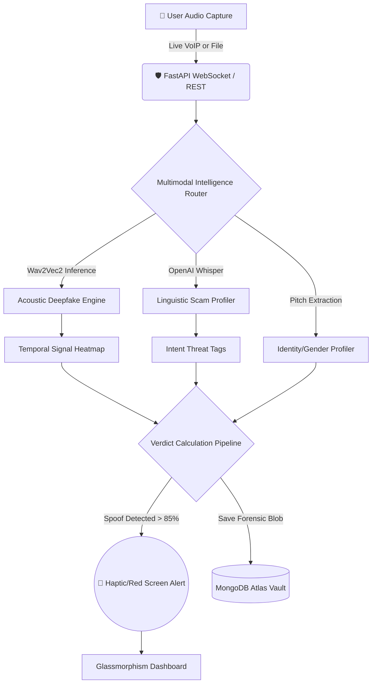

# VoiceSentinel: Multimodal Deepfake Defense Platform 

VoiceSentinel is an enterprise-grade forensic intelligence dashboard engineered to detect, intercept, and record **Voice Spoofing** and **Linguistic Scams** in real-time. Built entirely on a Python FastApi/WebSocket architecture, it fuses deep acoustic anomaly detection with natural language urgency scoring to hunt modern AI voice generators.

---

## 🏗️ Detailed System Architecture

VoiceSentinel abandons simple "robotic tone" matching. Instead, it employs a highly concurrent, multimodal processing engine designed for live-call defense and offline forensics.

### 1. The Multimodal Intelligence Core (`intelligence.py`)
*   **Acoustic Fingerprinting**: Leverages **Wav2Vec2** to analyze micro-frequency anomalies injected by text-to-speech generators. 
*   **Linguistic NLP Profiling**: Uses **OpenAI Whisper** transcribing audio concurrently to detect coercive social-engineering intents (e.g., `FINANCIAL`, `URGENCY`, `SECURITY`).
*   **Temporal Heatmap Generation**: Splits audio buffers into 10 distinct bins (Zero-Crossing Rate + Spectral Centroid), returning a visually mappable "Synthetic Fingerprint" across the wave.
*   **Explainable AI (SHAP focus)**: Identifies exactly *why* a voice failed authentication based on granular frequency data.

### 2. High-Fidelity Glassmorphism Dashboard
*   **Call Defense Shield**: A compact, floating UI widget designed to run beside Zoom or WhatsApp. It monitors your system's virtual audio cables and flashes a **Red Alert** if a deepfake crosses the 85% risk threshold.
*   **Standby Guardian**: A background acoustic trigger. It uses the `MediaStream Audio UI` to listen for ringtone volume spikes.
*   **Hardware APIs**: VoiceSentinel taps into the **Screen Wake Lock API** (preventing devices from sleeping during defense mode) and the **Navigator Vibration API** to send haptic pulses to your smartphone during a high-risk attack.
*   **Local Call Archiving**: End-to-end integration mapping Web Audio `MediaRecorder` buffers into instantly downloadable `.wav` blobs for forensic preservation.

### 3. Production Persistence
*   **Strict MongoDB Atlas**: Relies on asynchronous database access (`motor`) for non-blocking audit logging. Every scan is encrypted and firmly maintained in your personal history vault. **VoiceSentinel will purposefully crash in production** if physical database variables are not detected—ensuring true zero-trust operations.

---

## 🛤️ Zero-Trust Data Flow

### Mermaid Flowchart (For GitHub/Modern Viewers)


### Classic ASCII Flowchart (For Text Interfaces)
```text
[ 🎤 Audio Source ] (Live Stream / File Upload / Standby Capture)
        │
        ▼
[ 🛡️ FastAPI Intelligence Hub ]
        │
        ├──► Wav2Vec2 Engine ───────► (Frequency Anomaly Mapping)
        │
        ├──► OpenAI Whisper ───────► (Linguistic Intent Extraction)
        │
        └──► Persona Classifier ────► (Voice Pitch & Gender Isolation)
        │
        ▼
[ 🧠 Core Verification Pipeline ] 
        │
        ├──► IF Risk > 85% ────────► Trigger [📱 Device Haptics & Red Alert]
        │
        ├──► Compile Heatmaps ──────► Output [📊 Glassmorphism Dashboard]
        │
        └──► Export Audio Blob ─────► Provide [💾 Local Wav Download]
        │
        ▼
[ 🗄️ MongoDB Atlas Persistence ] 
        └──► Encrypted Security Log
```

---

## 🛠️ Technology Stack

*   **Backend Application**: Python 3.9+, FastAPI, Uvicorn, WebSockets.
*   **Machine Learning**: PyTorch, Transformers Suite (Wav2Vec2), Librosa, OpenAI Whisper.
*   **System Audio**: FFmpeg, libsndfile1.
*   **Data Vault**: MongoDB Atlas, Motor (Asynchronous Driver).
*   **User Interface**: Tailwind CSS, HTML5 Canvas, Vanilla Javascript (Framer-style `IntersectionObserver` layouts).

---

## 🚀 Deployment Operations

VoiceSentinel is configured for professional cloud environments to ensure mobile hardware APIs (which require secure HTTPS contexts) function perfectly.

### Method 1: Hugging Face Spaces (Recommended)
Hugging Face Spaces provide a generous **16GB RAM** free tier, ideal for running our PyTorch forensic models.

1.  **Create a Space**: Go to [Hugging Face Spaces](https://huggingface.co/new-space).
2.  **Configuration**: Select **Docker** as the Space SDK.
3.  **Deployment**: Connect your GitHub repository (`Jahanvi3005/voicesentinel`).
4.  **Environment Variables**: In the Space Settings, add your `MONGO_URI` connection string.
5.  **Build**: Hugging Face will automatically detect the `Dockerfile` and metadata in this README and start the build.

### Method 2: Local Development
Ensure your machine has `ffmpeg` installed.

1.  **Install Dependencies**:
    ```bash
    pip install -r requirements.txt
    ```
2.  **Database Connection**:
    Add `MONGO_URI` to your `.env` file.
3.  **Boot the Forensic Engine**:
    ```bash
    python main.py
    ```
4.  Access the dashboard at `http://localhost:7860/`.

---

*Engineered with 🛡️ by AntiGravity Engine Developers.*
